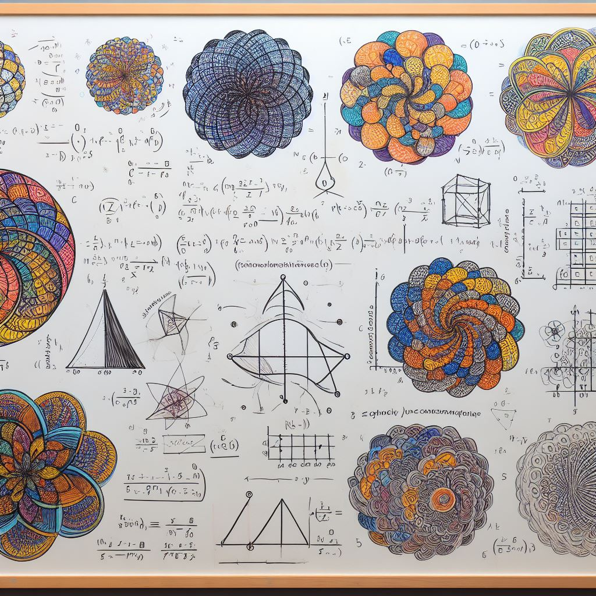

# Metodos_numericos
Repositorio con scripts donde están programados algunos algoritmos de métodos numéricos. Estos codigos son los que elabore para mi curso de métodos numéricos que impartí en el Instituto Tecnologico de Celaya. A continuación la lista de métodos que se abordan el los scripts.

## Lista de métodos numéricos:

### Optimización
* Método del gradinte (maxima pendiente)
* Método de Broyden
* Newton Raphson multivariable modificado
* Newton Raphson multivariable

### Integración
* Simpson

### Ecuaciones diferenciales ordinarias (EDOs)
* Euler
* Euler modificado
* Runge-Kutta 4to orden (RK4)
* Ralston
* Punto medio

### Interpolación
* Interpolación de Lagrange
* Polinomios de Newton

### Sistemas de ecuaciones
* LU
* Krylov
* Gauss
* Gauss-Seidel

## Cometarios
Si se quiere indagar más sobre las tecnicas numéricas, estos algorimos fueron elaborados con base a la siguiente referencia, *Raymond P. Canale y Steven C. Chapra, Métodos numéricos para ingenieros*.
